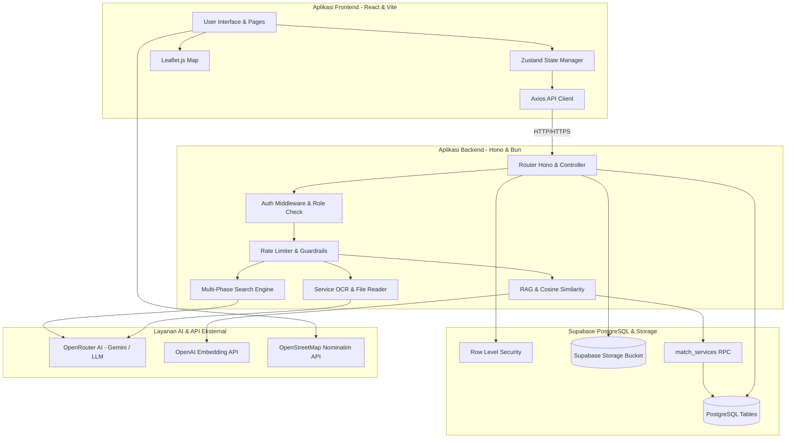
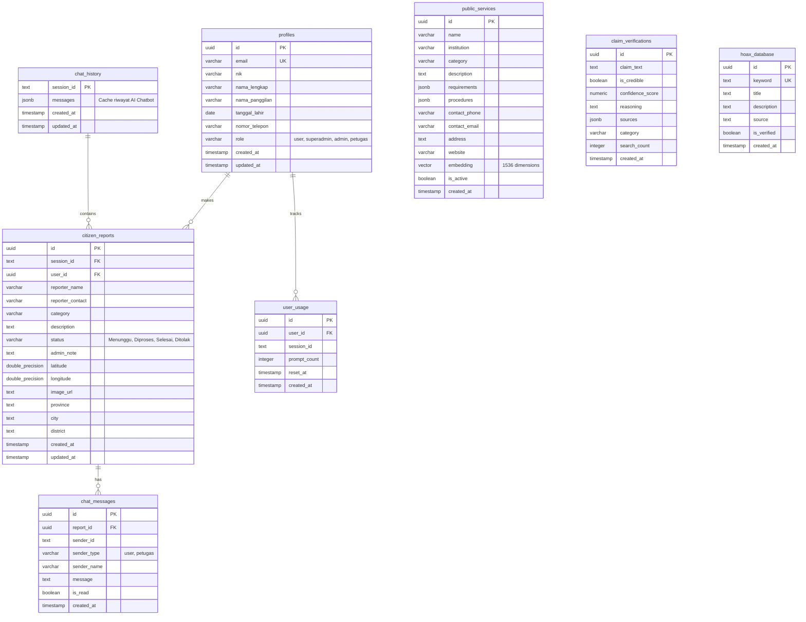
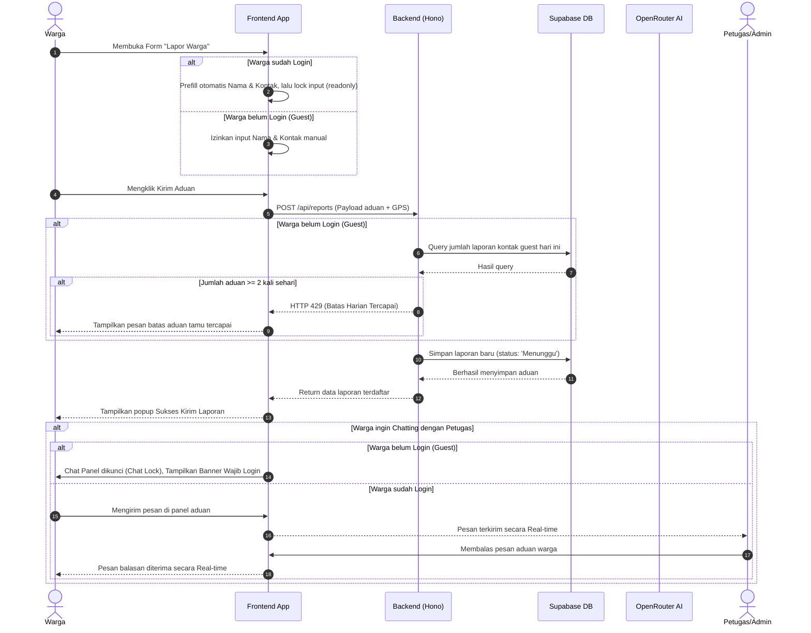

# 🏛️ KOMUNITAS - AI Assistant & Valid Information Portal

> **Solusi Portal Informasi Publik, Verifikasi Berita Hoaks, Ringkasan Dokumen Birokrasi, dan Layanan Pengaduan Warga Terintegrasi AI**  
> *Kasus Proyek Komunitas - LKS EKKA National Competition 2026*

```
┌─────────────────────────────────────────────────────────────────────────────┐
│                             🛠️ TECH STACK CARD                              │
├─────────────────────────────────────────────────────────────────────────────┤
│ 💻 Frontend          : React 18 (TS) | Vite | TailwindCSS | Leaflet.js     │
│ ⚙️ Backend           : Bun Runtime | Hono.js Framework (TS) | Zod           │
│ 💾 Database & Auth   : Supabase (PostgreSQL) | pgvector | Row Level Security│
│ 🧠 AI & Integration  : OpenRouter API (Gemini/LLM) | OpenAI Embeddings      │
└─────────────────────────────────────────────────────────────────────────────┘
```

### 📖 Dokumentasi Developer / Developer Documentation
Untuk detail lengkap seluruh API, parameter, skema database, skema respon, skema WebSocket real-time, dan limitasi sistem, silakan baca:  
* **[API_DOCUMENTATION.md](file:///c:/ryuka/lks-ai-2026/KOMUNITAS/backend/API_DOCUMENTATION.md)**

---

## 📌 Deskripsi Proyek

**KOMUNITAS** adalah platform pelayanan publik digital modern yang dirancang untuk menjembatani kesenjangan komunikasi antara warga dan instansi pelayanan publik. Platform ini mengintegrasikan teknologi **Artificial Intelligence (AI)** untuk membantu warga mendapatkan informasi layanan publik yang tervalidasi secara cepat, memverifikasi berita atau klaim hoaks di internet secara real-time, meringkas dokumen birokrasi yang panjang menjadi diagram alir birokrasi visual (`Mermaid.js`), dan melaporkan aduan warga dengan penentuan koordinat GPS langsung ke dashboard admin dan petugas pelayanan.

Aplikasi ini menggunakan arsitektur modern berkecepatan tinggi dengan backend berbasis **Bun & Hono Framework** (TypeScript) serta frontend responsif berbasis **React 18 & Vite** (TypeScript). Data persisten, otentikasi peran (role-based), koordinat spasial aduan, dan sistem pesan real-time dikelola sepenuhnya oleh **Supabase (PostgreSQL)** dengan sistem keamanan tingkat tinggi melalui **Row Level Security (RLS)**.

---

## 🚀 Fitur Utama Sistem

### 1. AI Chatbot Cerdas (RAG Pipeline)
* Warga dapat berkonsultasi mengenai prosedur layanan publik (seperti pendaftaran PKH, pelaporan kekerasan anak ke KPAI, atau kontak darurat PMI).
* Sistem menggunakan **Retrieval-Augmented Generation (RAG)** berbasis pencarian kesamaan kosinus (*cosine similarity search*) pada data vektor (1536 dimensi) dokumen layanan publik resmi di Supabase menggunakan model embedding OpenAI.

### 2. Klaim & Verifikasi Berita Hoaks (Web Search Grounding)
* Menyediakan validasi klaim atau rumor secara real-time untuk menyaring misinformasi.
* Menggunakan **Multi-Phase Web Search Grounding** melalui API pencarian internet untuk mencocokkan kredibilitas klaim dengan sumber resmi cek fakta di seluruh Indonesia, menghitung tingkat akurasi (*confidence score*), dan memetakan referensi tautan sumber.

### 3. Ringkasan Dokumen & Pembuat Diagram Alir (Flowchart Generator)
* Meringkas isi file dokumen legalitas atau birokrasi pemerintah yang panjang (seperti file PDF/Teks).
* AI secara otomatis memecah ringkasan menjadi poin-poin utama serta menghasilkan sintaks **Mermaid Flowchart** sehingga warga dapat memahami alur birokrasi secara visual.

### 4. Analisis Dokumen Berbasis Kamera (OCR)
* Ekstraksi teks otomatis (*Optical Character Recognition*) dari gambar atau foto dokumen resmi (seperti KTP, KK, Akta, Surat Kuasa) untuk keperluan integrasi formulir pengaduan.

### 5. Sistem Aduan Warga Real-Time & Live Map
* Pelaporan masalah daerah secara langsung menggunakan koordinat GPS (Geolokasi) dan unggahan foto bukti.
* **Smart Geocoding**: Mengonversi titik koordinat GPS secara otomatis menjadi alamat tekstual (Provinsi, Kota/Kabupaten, Kecamatan) melalui OpenStreetMap Nominatim API secara real-time.
* Dilengkapi dengan peta interaktif (*Leaflet.js*) di dashboard admin untuk melihat pemetaan sebaran lokasi aduan warga di peta digital secara visual.

### 6. Ruang Diskusi Interaktif Warga & Petugas (2-Way Real-time Chat)
* Warga yang telah masuk (login) dapat memulai percakapan diskusi interaktif secara langsung dengan petugas pelayanan publik untuk menanyakan kelanjutan aduan mereka.
* Antarmuka chat interaktif dilengkapi dengan sistem pembatasan akses (*chat lock*) bagi tamu (guest) untuk menjaga privasi dan keamanan sistem.

### 7. Dashboard Admin & Manajemen Staff
* Manajemen status aduan (*Menunggu*, *Diproses*, *Selesai*, *Ditolak*) dengan catatan tanggapan admin (*admin note*).
* **Kelola Staf Dua Sub-Tab**: 
  * *Sub-Tab 1 (Daftar Akun Staff)*: Menampilkan seluruh akun staf pelayanan yang aktif beserta data NIK, Email, No. HP, dan tingkat peran mereka.
  * *Sub-Tab 2 (Registrasi Staff Baru)*: Formulir pendaftaran akun staf pelayanan/admin baru yang terverifikasi dan aman.

---

## 🗺️ Visualisasi Analisis & Alur Sistem

### 🖥️ Arsitektur Sistem Terintegrasi (System Architecture)
Diagram berikut menjelaskan bagaimana komponen Frontend, Backend, Database Supabase, AI API, Web Search, dan Integrasi Bot bekerja secara berkesinambungan:



---

### 🗄️ Entity Relationship Diagram (ERD)
Diagram di bawah mendefinisikan hubungan antar tabel dalam database Supabase PostgreSQL:



---

### 🎭 Diagram Kasus Penggunaan (Use Case Diagram)
Diagram ini merangkum kapabilitas dari masing-masing tingkat pengguna sistem:

```mermaid
graph TD
    %% Actors
    Actor_Guest[Warga Tamu / Guest]
    Actor_User[Warga Terdaftar / User]
    Actor_Staff[Petugas Pelayanan]
    Actor_Admin[Superadmin / Admin]

    %% Use Cases
    subgraph UseCases [Kasus Penggunaan Sistem]
        UC_ChatAI(Konsultasi AI Chatbot - RAG)
        UC_CheckHoax(Cek Klaim Fakta Hoaks)
        UC_Ocr(Ekstraksi Teks OCR Dokumen)
        UC_Summary(Meringkas Dokumen & Mermaid Flowchart)
        
        UC_SubmitReport(Mengirim Laporan Aduan)
        UC_ChatStaff(Chat Dua Arah dengan Petugas)
        UC_ViewStatus(Pantau Status Aduan & Live Map)
        
        UC_ManageReport(Mengelola Status Aduan Warga)
        UC_ManageStaff(Mengelola Akun Staff & Pendaftaran)
    end

    %% Guest Permissions
    Actor_Guest --> UC_ChatAI
    Actor_Guest --> UC_CheckHoax
    Actor_Guest --> UC_Ocr
    Actor_Guest --> UC_Summary
    Actor_Guest --> |"Maksimal 2x/Hari"| UC_SubmitReport
    Actor_Guest --> UC_ViewStatus

    %% Registered User Permissions
    Actor_User --> UC_ChatAI
    Actor_User --> UC_CheckHoax
    Actor_User --> UC_Ocr
    Actor_User --> UC_Summary
    Actor_User --> |"Tanpa Batas Harian"| UC_SubmitReport
    Actor_User --> UC_ChatStaff
    Actor_User --> UC_ViewStatus

    %% Staff / Petugas Permissions
    Actor_Staff --> UC_ChatStaff
    Actor_Staff --> UC_ManageReport
    Actor_Staff --> UC_ViewStatus

    %% Admin Permissions
    Actor_Admin --> UC_ChatStaff
    Actor_Admin --> UC_ManageReport
    Actor_Admin --> UC_ViewStatus
    Actor_Admin --> UC_ManageStaff
```



---

### 🔄 Alur Logika Aplikasi (Application Sequence Flow)
Alur interaksi warga mulai dari pengaduan, verifikasi AI, hingga penanganan di sisi petugas:



---

## 🛠️ Stack Teknologi

| Komponen | Teknologi | Deskripsi |
| :--- | :--- | :--- |
| **Frontend Runtime** | React 18 (TypeScript) | UI Library utama yang cepat dan modular. |
| **Build Tools** | Vite | Bundler super cepat untuk pengembangan dan produksi. |
| **Backend Runtime** | Bun | JavaScript runtime berkinerja tinggi, pengganti Node.js. |
| **Backend Framework**| Hono.js | Web framework minimalis dan super cepat untuk API. |
| **Database** | Supabase (PostgreSQL) | Database relasional dengan native support Vector (`pgvector`). |
| **State Management** | Zustand | State management ringan untuk sinkronisasi antarmuka. |
| **AI LLM Engine** | OpenRouter (Gemini Pro) | Model AI tingkat lanjut untuk RAG chatbot, OCR, dan ringkasan. |
| **Map Rendering** | Leaflet.js | Visualisasi peta koordinat laporan warga. |
| **CSS Styling** | TailwindCSS | Framework CSS utility-first untuk desain modern. |

---

## 💻 Panduan Instalasi & Cara Menjalankan

### Persyaratan Awal (Prerequisites)
Pastikan komputer Anda sudah menginstal:
* **Bun Runtime** (Rekomendasi v1.0.0 atau ke atas) -> [Instal Bun](https://bun.sh)
* **Node.js** (Minimal v18 untuk kompatibilitas frontend)

---

### Langkah 1: Kloning Repositori
```bash
git clone https://github.com/RyukaAngga/komunitass.git
cd komunitass
```

---

### Langkah 2: Setup Database & PostgreSQL (Supabase)
1. Buat proyek baru di [Supabase Dashboard](https://supabase.com).
2. Salin seluruh isi file [backend/database.sql](file:///c:/ryuka/lks-ai-2026/KOMUNITAS/backend/database.sql) dan jalankan di **SQL Editor** pada dashboard Supabase Anda.
3. Query SQL tersebut akan otomatis membuat tabel-tabel utama, indeks, fungsi pgvector, RLS, dan relasi tabel.

---

### Langkah 3: Konfigurasi & Menjalankan Backend Server
1. Masuk ke folder backend:
   ```bash
   cd backend
   ```
2. Instal semua dependensi menggunakan Bun:
   ```bash
   bun install
   ```
3. Duplikat file konfigurasi `.env` dan isi sesuai kredibel Supabase & OpenRouter Anda:
   ```bash
   cp .env.example .env
   ```
   *Isi parameter berikut di dalam `.env`*:
   ```env
   PORT=3000
   SUPABASE_URL=https://your-supabase-project.supabase.co
   SUPABASE_ANON_KEY=eyJhbGciOiJIUzI1NiIsInR5cCI6IkpXVCJ9...
   OPENROUTER_API_KEY=sk-or-v1-...
   EMBEDDING_API_KEY=sk-... # OpenAI API key untuk embeddings
   ```
4. Jalankan seeder bawaan untuk memuat basis pengetahuan awal layanan publik ke database vektor Supabase:
   ```bash
   bun run src/index.ts --seed  # Atau via skrip penyiapan database
   ```
5. Jalankan backend dalam mode pengembangan:
   ```bash
   bun run dev
   ```
   *Server backend Anda sekarang aktif di `http://localhost:3000`.*

---

### Langkah 4: Konfigurasi & Menjalankan Frontend Web
1. Buka terminal baru dan arahkan ke folder frontend:
   ```bash
   cd ../frontend
   ```
2. Instal semua dependensi frontend:
   ```bash
   npm install
   ```
3. Jalankan server pengembangan frontend:
   ```bash
   npm run dev
   ```
   *Aplikasi web Anda kini dapat diakses di `http://localhost:5173`.*

---

## 📌 Dokumentasi API Endpoint

Berikut adalah daftar endpoint API yang disediakan oleh Backend (Hono) untuk melayani aplikasi:

### 🔐 API Otentikasi & Akun (`/api/auth`)
| Metode | Endpoint | Hak Akses | Deskripsi |
| :--- | :--- | :--- | :--- |
| `POST` | `/api/auth/register` | Publik | Mendaftarkan akun warga baru dengan profil NIK lengkap. |
| `POST` | `/api/auth/login` | Publik | Otentikasi masuk akun dan mendapatkan token JWT. |
| `GET` | `/api/auth/me` | User Login | Mengambil data detail profil akun pengguna yang sedang login. |
| `POST` | `/api/admin/create-user`| Admin/Superadmin | Membuat akun staf pelayanan baru (role: *petugas*, *admin*). |
| `GET` | `/api/admin/staff` | Admin/Superadmin | Mengambil daftar seluruh akun staf pelayanan yang terdaftar di sistem. |

### 💬 API Layanan Chat & AI (`/api/chat`)
| Metode | Endpoint | Hak Akses | Deskripsi |
| :--- | :--- | :--- | :--- |
| `POST` | `/api/chat` | Publik | Chatbot AI standar dengan pipeline RAG dokumen layanan publik. |
| `POST` | `/api/chat/stream` | Publik | Chatbot AI mode streaming SSE untuk respons karakter demi karakter. |
| `POST` | `/api/chat/validate` | Publik | Menguji dan memverifikasi klaim berita hoaks dengan Web Grounding. |
| `POST` | `/api/chat/summarize` | Publik | Meringkas dokumen panjang serta memformat diagram alir `Mermaid.js`. |
| `POST` | `/api/chat/ocr` | Publik | Mengekstrak tulisan dari file gambar/foto dokumen resmi. |

### 📋 API Manajemen Pengaduan (`/api/reports`)
| Metode | Endpoint | Hak Akses | Deskripsi |
| :--- | :--- | :--- | :--- |
| `POST` | `/api/reports` | Publik (Maks 2x/hari) | Mengirimkan laporan aduan warga terintegrasi GPS & foto. |
| `GET` | `/api/reports` | Semua / Admin | Mengambil daftar aduan warga (warga biasa disamarkan datanya). |
| `PATCH`| `/api/reports/:id` | Admin/Petugas | Mengubah status aduan (*Menunggu/Diproses/Selesai/Ditolak*) dan catatan admin. |
| `GET` | `/api/reports/statistics`| Admin/Petugas | Mengambil statistik sebaran sebaran aduan per daerah/wilayah. |
| `GET` | `/api/chat/active` | Admin/Petugas | Mengambil daftar obrolan aduan aktif yang membutuhkan respon segera. |

---

## 🛡️ Kebijakan Keamanan & Pembatasan Sistem

Untuk mencegah eksploitasi, platform KOMUNITAS dilengkapi dengan sistem pertahanan terintegrasi:

1. **Row Level Security (RLS) di Supabase**:
   * Setiap tabel di Supabase diproteksi oleh RLS. Warga biasa hanya diizinkan melihat profil pribadi dan pesan obrolan miliknya sendiri.
   * Staf pelayanan publik (Admin/Petugas) diberikan otorisasi khusus berbasis claims JWT untuk memantau aduan secara kolektif.
2. **Batas Prompts Harian AI (AI Prompt Rate Limits)**:
   * **Guest (Belum Login)**: Dibatasi maksimal **7 prompt per 24 jam** untuk menghindari spam penggunaan kuota LLM OpenRouter.
   * **User (Sudah Login)**: Diberikan kuota lebih luas hingga **20 prompt per 24 jam**.
3. **Batas Laporan Harian Tamu (Guest Daily Report Limits)**:
   * Pengguna tanpa login (guest) dibatasi hanya boleh mengirim **maksimal 2 aduan per hari** berdasarkan nomor kontak/WhatsApp pengirim untuk mencegah bot spam aduan palsu.
4. **Sistem Pengunci Chat (Chat Lock)**:
   * Fitur obrolan dua arah dengan petugas pelayanan terkunci rapat bagi tamu. Tamu diwajibkan melakukan registrasi/login akun menggunakan NIK resmi terlebih dahulu sebelum dapat berkomunikasi dengan petugas.

---

## 📄 Lisensi

Platform ini dirilis di bawah **MIT License**. Anda bebas memodifikasi dan membagikannya kembali untuk keperluan pembelajaran atau pengembangan lebih lanjut.

---

*Dibuat dengan penuh dedikasi untuk kesuksesan LKS EKKA National Competition 2026. Platform Komunitas Siap Menerangi Birokrasi Indonesia! 🇮🇩*
