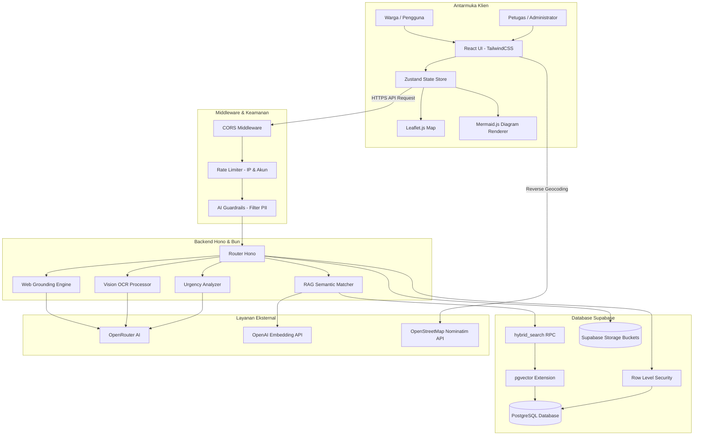

# KOMUNITAS — Portal Pelayanan Publik dan Validasi Informasi Berbasis AI

Platform informasi publik monorepo terpadu yang dirancang untuk mendukung penyediaan data administratif, verifikasi klaim hoaks melalui penelusuran web waktu-nyata, ringkasan dokumen regulasi, dan sistem pelaporan warga terintegrasi.

Dokumen ini disusun sebagai bagian dari dokumentasi proyek untuk kompetisi tingkat nasional **LKS EKKA National Competition 2026**.

---

## Tim Pengembang (Pencari Berkah)

Pengembangan sistem, perancangan arsitektur, dan integrasi kecerdasan buatan dalam platform ini dilakukan secara kolaboratif oleh:

* **Fahri Angga Pratama** — Perancangan Arsitektur, Pengembangan Backend, dan Integrasi Model AI.
* **Fikri Awaluddin Rahmat** — Pengembangan Frontend, Desain Antarmuka (UI/UX), dan Integrasi Geografis (GIS).
* **Alif Ikhwan** — Manajemen Infrastruktur (DevOps), Pengujian Keandalan Sistem, dan Keamanan Database.

---

## Struktur Direktori Monorepo

Sistem ini dikelola menggunakan struktur monorepo guna memudahkan sinkronisasi antarmuka dan API:

* **[Direktori Root](file:///c:/ryuka/lks-ai-2026/KOMUNITAS/)** — Konfigurasi repositori global, dokumentasi arsitektur, dan lisensi.
* **[Aplikasi Frontend](file:///c:/ryuka/lks-ai-2026/KOMUNITAS/frontend/)** — Klien web warga berbasis React 18, visualisasi alur birokrasi, dan dashboard admin.
* **[Server Backend](file:///c:/ryuka/lks-ai-2026/KOMUNITAS/backend/)** — Server API berbasis Hono (Bun runtime), mesin pencarian hibrida, dan filter PII.

---

## Latar Belakang dan Rumusan Masalah

Akses terhadap layanan birokrasi dan informasi publik di Indonesia sering kali terkendala oleh beberapa permasalahan mendasar:
1. **Kompleksitas Regulasi**: Dokumen regulasi pemerintah umumnya ditulis dalam format hukum yang panjang dan kaku, sehingga masyarakat awam kesulitan memahami prosedur administratif secara mandiri.
2. **Penyebaran Informasi Palsu (Hoaks)**: Kecepatan penyebaran rumor di ruang digital memerlukan alat verifikasi yang cepat dan objektif untuk membandingkan informasi dengan fakta dari portal berita tepercaya.
3. **Penyampaian Pengaduan yang Kurang Efektif**: Laporan keluhan warga mengenai masalah infrastruktur daerah sering kali kurang presisi karena tidak disertai data lokasi (koordinat riil) dan belum diklasifikasikan secara otomatis berdasarkan skala prioritas kedaruratan.

---

## Solusi Teknis Platform

Platform KOMUNITAS mengintegrasikan teknologi kecerdasan buatan (AI) untuk memberikan solusi atas permasalahan tersebut:

* **Pencarian Informasi Birokrasi (RAG)**: Menggunakan pencarian vektor semantik (*cosine similarity*) untuk memetakan pertanyaan pengguna ke basis pengetahuan regulasi resmi yang telah diindeks di PostgreSQL, meminimalkan jawaban tidak akurat (halusinasi).
* **Verifikasi Berita Instan (Web Grounding)**: Menghubungkan modul AI dengan pencarian internet multi-fase guna memverifikasi kebenaran informasi langsung terhadap portal cek fakta tepercaya, menampilkan *confidence score* serta pranala rujukan.
* **Visualisasi Alur Kerja (Diagram Alir Mermaid.js)**: Mengekstrak dokumen administratif yang panjang dan merendernya ke dalam diagram birokrasi visual (`Mermaid.js`) secara langsung pada browser pengguna.
* **Pengaduan Lokasional dan Analisis Prioritas**: Warga dapat mengirim laporan disertai foto dan koordinat GPS (menggunakan Leaflet.js). Backend secara otomatis menggunakan AI untuk menentukan tingkat kedaruratan laporan (Kritis, Tinggi, Sedang, Rendah) demi efisiensi penanganan oleh petugas.

---

## Kajian Desain Arsitektur dan Analisis Rekayasa Sistem

Dalam proses perancangan dan pengembangan platform KOMUNITAS, terdapat beberapa keputusan rekayasa sistem penting yang kami ambil untuk menjaga akurasi, keamanan, dan keandalan sistem:

### 1. Mitigasi Risiko Halusinasi AI melalui RAG
Model bahasa besar (LLM) generatif memiliki risiko menghasilkan informasi yang tidak akurat (halusinasi). Untuk memastikan jawaban asisten AI seputar prosedur pelayanan publik sepenuhnya valid, kami menerapkan metode **Retrieval-Augmented Generation (RAG)**. 
Ketika pengguna mengajukan pertanyaan, sistem tidak langsung meneruskannya ke LLM. Backend terlebih dahulu memindai database PostgreSQL menggunakan pencarian kemiripan vektor. Hasil pencarian regulasi resmi tersebut disisipkan sebagai instruksi konteks yang mengikat ke dalam sistem prompt. Kami memberikan instruksi ketat agar AI hanya memformulasikan jawaban berdasarkan rujukan yang disediakan dan secara tegas menolak menjawab jika data rujukan tidak mencukupi.

### 2. Efisiensi Pencarian Informasi dengan Metode Hybrid Search (RRF)
Kami menggabungkan metode **Vector Search** (pencarian kemiripan semantik menggunakan ekstensi `pgvector` di PostgreSQL) dan **Full-Text Search (FTS)** menggunakan indeks teks tradisional bahasa Indonesia. 
Pencarian vektor sangat baik dalam memahami niat dan konteks kalimat pengguna, namun kurang efektif dalam mencari istilah eksak seperti nomor undang-undang atau singkatan lembaga. Sebaliknya, FTS sangat presisi pada pencarian kata kunci eksak tetapi tidak memahami sinonim atau konteks. Gabungan kedua hasil pencarian ini dinormalisasi menggunakan bobot gabungan sebelum disajikan kepada asisten AI, sehingga menghasilkan rujukan birokrasi yang jauh lebih lengkap dan akurat.

### 3. Perlindungan Privasi Data Pengguna (PII Redaction)
Kepatuhan terhadap aspek keamanan informasi pribadi warga menjadi prioritas utama. Karena platform berinteraksi dengan API AI pihak ketiga (OpenRouter), kami mengimplementasikan lapisan filter **PII Redaction** di backend. 
Sebelum teks pengaduan dikirim ke model AI untuk analisis, filter ini secara otomatis mendeteksi dan menyamarkan informasi pribadi seperti Nomor Induk Kependudukan (NIK 16 digit), nomor telepon seluler (format Indonesia), dan alamat surat elektronik (email). Data sensitif tersebut disensor menggunakan token generik sebelum proses inferensi LLM dilakukan, guna mencegah kebocoran informasi identitas warga.

### 4. Skema Penilaian Urgensi Pengaduan Secara Asinkron
Untuk menjaga agar API pengaduan tetap responsif ketika menerima laporan warga yang padat, backend tidak memproses penilaian urgensi AI secara sinkron (yang memblokir thread proses server). 
Pengiriman laporan dikonfirmasi secara instan ke sisi warga terlebih dahulu. Setelah itu, server menjalankan tugas latar belakang (*background task*) untuk meminta evaluasi tingkat kedaruratan dari model AI secara non-blocking, lalu secara otomatis memperbarui nilai status urgensi aduan di database. Hal ini menjamin skalabilitas server tetap terjaga dengan baik.

### 5. Konsistensi Pembaruan Data Real-time
Status pengaduan warga yang diperbarui oleh petugas di dashboard admin disiarkan secara instan menggunakan protokol **Server-Sent Events (SSE)**. Dibandingkan dengan metode penarikan berkala (*polling*), penggunaan koneksi searah yang ringan ini secara signifikan mengurangi beban overhead koneksi database dan menyajikan pembaruan status laporan secara instan pada browser warga.

---

## Alur Data dan Arsitektur Global



---

## Panduan Instalasi dan Konfigurasi

### Prasyarat Sistem
* **Bun Runtime (v1.1.0 atau lebih baru)**
* **Node.js (v18.0 atau lebih baru) & npm**
* **Git**

### Langkah 1: Kloning Repositori
```bash
git clone https://github.com/RyukaAngga/komunitasai.git
cd komunitasai
```

### Langkah 2: Migrasi Struktur Database Supabase
Jalankan berkas SQL berikut secara berurutan pada SQL Editor dashboard Supabase Anda:
1. `backend/database.sql` — Tabel dasar, indeks, dan aturan RLS.
2. `backend/migration_hybrid_urgency.sql` — Ekstensi `pgvector` dan fungsi hibrida.
3. `backend/migration_rag_documents.sql` — Metadata penyimpanan berkas RAG.

### Langkah 3: Setup Server Backend
1. Pindah ke direktori backend:
   ```bash
   cd backend
   ```
2. Instal dependensi:
   ```bash
   bun install
   ```
3. Salin dan buat berkas `.env`:
   ```bash
   cp .env.example .env
   ```
4. Sesuaikan konfigurasi parameter database Supabase dan kunci OpenRouter dalam `.env`.
5. Jalankan seed data awal:
   ```bash
   bun run src/index.ts --seed
   ```
6. Jalankan server dalam mode pengembangan:
   ```bash
   bun dev
   ```

### Langkah 4: Setup Klien Frontend
1. Pindah ke direktori frontend:
   ```bash
   cd ../frontend
   ```
2. Instal dependensi:
   ```bash
   npm install
   ```
3. Buat berkas `.env` di direktori frontend dan masukkan kredensial URL API backend serta Supabase.
4. Jalankan aplikasi web:
   ```bash
   npm run dev
   ```

---

## Lisensi

Platform ini dirilis di bawah **MIT License**. Anda bebas menggunakan, memodifikasi, dan menyebarkan kode sumber ini untuk pengembangan lebih lanjut.

---
*Dibuat oleh Tim **Pencari Berkah** untuk LKS EKKA National Competition 2026.*
