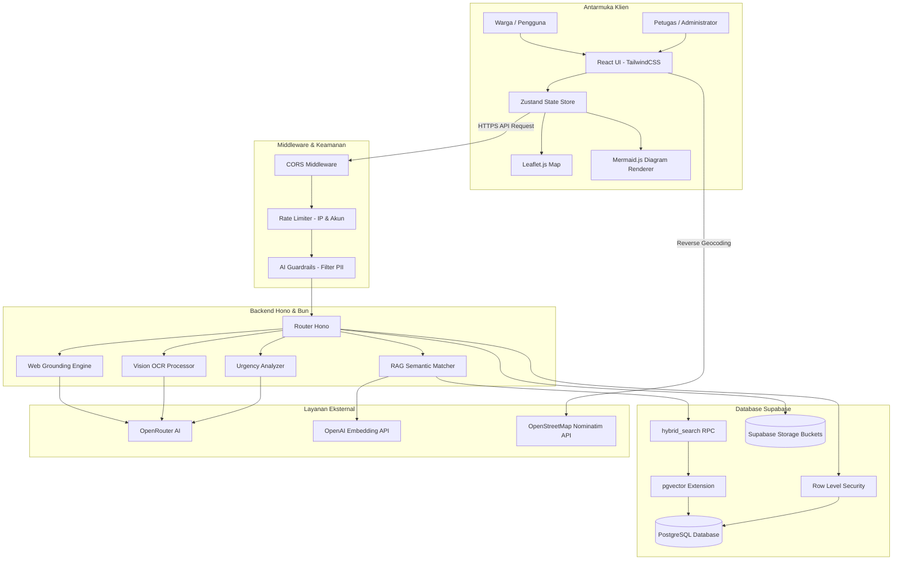

<p align="center">
  
</p>

<h1 align="center">KOMUNITAS — Portal Pelayanan Publik dan Validasi Informasi Berbasis AI</h1>

<p align="center">
  <strong>Platform Terpadu Layanan Warga, Cek Fakta (Web Grounding), Ringkasan Regulasi (Mermaid Flowchart), dan Sistem Pengaduan Spasial Real-time.</strong>
</p>

<p align="center">
  <a href="https://komunitasai.web.id" target="_blank"><strong>Kunjungi Aplikasi Live (komunitasai.web.id)</strong></a>
</p>

---

## Deskripsi Umum Proyek

**KOMUNITAS** adalah platform pelayanan publik digital terintegrasi yang dirancang untuk mempercepat akses informasi, menyaring berita bohong (hoaks), meringkas dokumen regulasi pemerintah, serta memfasilitasi pelaporan keluhan warga secara presisi dan real-time. Platform ini dirancang khusus untuk kompetisi tingkat nasional **LKS EKKA National Competition 2026**.

---

## Profil Tim Pengembang (SMK MARHAS Margahayu)

Platform ini dikembangkan dengan dedikasi tinggi oleh tim dari sekolah **SMK MARHAS Margahayu**:

* **Fachri Angga Pratama** (Ketua Tim / Full Stack Developer)  
  *Fokus Kerja: Arsitektur Basis Data Supabase, Logika RAG Engine, Web Grounding search compiler, dan sinkronisasi endpoint API di sisi Server serta Client.*
* **Alif Ikhwan Aulad Alhafidz** (Full Stack Creator)  
  *Fokus Kerja: Desain UI/UX Premium, Integrasi Visualisasi Mermaid.js, Kompilasi Frontend React 18, dan optimalisasi navigasi reaktif.*
* **Fikri Awalludin Rahmat** (Administrasi Projek)  
  *Fokus Kerja: Dokumentasi API Teknis, Manajemen Versi Konten RAG, Penyusunan Berkas SQL Migrasi, serta Analisis QA sistem.*

---

## Struktur Repositori Monorepo

Untuk kemudahan koordinasi dependensi, proyek ini dikelola dalam satu monorepo terpadu:

* **[Direktori Root](file:///c:/ryuka/lks-ai-2026/KOMUNITAS/)** — Pusat dokumentasi monorepo, konfigurasi lisensi, dan file analisis sistem.
* **[Aplikasi Frontend](file:///c:/ryuka/lks-ai-2026/KOMUNITAS/frontend/)** — Aplikasi klien web warga dan dashboard admin (React 18 & Vite). Detail teknis ada di [Frontend README](file:///c:/ryuka/lks-ai-2026/KOMUNITAS/frontend/README.md).
* **[Server Backend](file:///c:/ryuka/lks-ai-2026/KOMUNITAS/backend/)** — Server API dan mesin pemrosesan AI (Hono & Bun). Detail teknis ada di [Backend README](file:///c:/ryuka/lks-ai-2026/KOMUNITAS/backend/README.md).

---

## Latar Belakang dan Rumusan Masalah

Efektivitas interaksi antara warga dan instansi publik di Indonesia saat ini masih terhambat oleh tiga masalah utama:
1. **Sulitnya Memahami Regulasi Pemerintah**: Dokumen hukum dan alur administratif sering kali berlembar-lembar dan berbelit-belit, menyulitkan masyarakat awam yang memerlukan petunjuk cepat.
2. **Tingginya Penyebaran Rumor dan Hoaks**: Tanpa alat klarifikasi terpercaya, warga rentan termakan isu palsu yang menyebar luas secara online.
3. **Penyampaian Aspirasi Warga yang Lambat**: Sistem pelaporan konvensional sering kali tidak disertai koordinat GPS yang akurat dan tidak diurutkan berdasarkan tingkat kedaruratan laporan, sehingga menyulitkan respons cepat dari petugas lapangan.

---

## Solusi Fungsional Platform

Platform **KOMUNITAS** memberikan solusi terintegrasi melalui fitur-fitur berikut:

* **Asisten RAG Publik**: Menjawab konsultasi administratif warga menggunakan teknik pencarian vektor pada regulasi resmi, menjamin jawaban yang akurat dan terhindar dari bias informasi.
* **Verifikasi Berita Instan**: Mesin AI yang terhubung dengan pencari web otomatis untuk memverifikasi klaim di internet terhadap situs cek fakta kredibel nasional.
* **Ringkasan Regulasi Visual**: Mengonversi teks panjang berisi syarat administrasi menjadi bagan alir interaktif (`Mermaid.js`) yang langsung dirender di browser warga.
* **Laporan Warga Spasial**: Peta interaktif (Leaflet.js) yang memetakan titik koordinat keluhan warga beserta pengelompokan prioritas kedaruratan (Urgensi) otomatis dari asisten AI.

---

## Kajian Desain Arsitektur dan Analisis Rekayasa Sistem

Dalam proses perancangan dan pengembangan platform KOMUNITAS, terdapat beberapa keputusan rekayasa sistem penting yang kami ambil untuk menjaga akurasi, keamanan, dan keandalan sistem:

### 1. Mitigasi Risiko Halusinasi AI melalui RAG
Model bahasa besar (LLM) generatif memiliki risiko menghasilkan informasi yang tidak akurat (halusinasi). Untuk memastikan jawaban asisten AI seputar prosedur pelayanan publik sepenuhnya valid, kami menerapkan metode **Retrieval-Augmented Generation (RAG)**. 
Ketika pengguna mengajukan pertanyaan, sistem tidak langsung meneruskannya ke LLM. Backend terlebih dahulu memindai database PostgreSQL menggunakan pencarian kemiripan vektor. Hasil pencarian regulasi resmi tersebut disisipkan sebagai instruksi konteks yang mengikat ke dalam sistem prompt. Kami memberikan instruksi ketat agar AI hanya memformulasikan jawaban berdasarkan rujukan yang disediakan dan secara tegas menolak menjawab jika data rujukan tidak mencukupi.

### 2. Efisiensi Pencarian Informasi dengan Metode Hybrid Search (RRF)
Kami menggabungkan metode **Vector Search** (pencarian kemiripan semantik menggunakan ekstensi `pgvector` di PostgreSQL) dan **Full-Text Search (FTS)** menggunakan indeks teks tradisional bahasa Indonesia. 
Pencarian vektor sangat baik dalam memahami niat dan konteks kalimat pengguna, namun kurang efektif dalam mencari istilah eksak seperti nomor undang-undang atau singkatan lembaga. Sebaliknya, FTS sangat presisi pada pencarian kata kunci eksak tetapi tidak memahami sinonim atau konteks. Gabungan kedua hasil pencarian ini dinormalisasi menggunakan bobot gabungan sebelum disajikan kepada asisten AI, sehingga menghasilkan rujukan birokrasi yang jauh lebih lengkap dan akurat.

### 3. Perlindungan Privasi Data Pengguna (PII Redaction)
Kepatuhan terhadap aspek keamanan informasi pribadi warga menjadi prioritas utama. Karena platform berinteraksi dengan API AI pihak ketiga (OpenRouter), kami mengimplementasikan lapisan filter **PII Redaction** di backend. 
Sebelum teks pengaduan dikirim ke model AI untuk analisis, filter ini secara otomatis mendeteksi dan menyamarkan informasi pribadi seperti Nomor Induk Kependudukan (NIK 16 digit), nomor telepon seluler (format Indonesia), dan alamat surat elektronik (email). Data sensitif tersebut disensor menggunakan token generik sebelum proses inferensi LLM dilakukan, guna mencegah kebocoran informasi identitas warga.

### 4. Skema Penilaian Urgensi Pengaduan Secara Asinkron
Untuk menjaga agar API pengaduan tetap responsif ketika menerima laporan warga yang padat, backend tidak memproses penilaian urgensi AI secara sinkron (yang memblokir thread proses server). 
Pengiriman laporan dikonfirmasi secara instan ke sisi warga terlebih dahulu. Setelah itu, server menjalankan tugas latar belakang (*background task*) untuk meminta evaluasi tingkat kedaruratan dari model AI secara non-blocking, lalu secara otomatis memperbarui nilai status urgensi aduan di database. Hal ini menjamin skalabilitas server tetap terjaga dengan baik.

### 5. Konsistensi Pembaruan Data Real-time
Status pengaduan warga yang diperbarui oleh petugas di dashboard admin disiarkan secara instan menggunakan protokol **Server-Sent Events (SSE)**. Dibandingkan dengan metode penarikan berkala (*polling*), penggunaan koneksi searah yang ringan ini secara signifikan mengurangi beban overhead koneksi database dan menyajikan pembaruan status laporan secara instan pada browser warga.

---

## Alur Data dan Arsitektur Global



---

## Panduan Instalasi dan Konfigurasi

### Prasyarat Sistem
* **Bun Runtime (v1.1.0 atau lebih baru)**
* **Node.js (v18.0 atau lebih baru) & npm**
* **Git**

### Langkah 1: Kloning Repositori
```bash
git clone https://github.com/RyukaAngga/komunitasai.git
cd komunitasai
```

### Langkah 2: Migrasi Struktur Database Supabase
Jalankan berkas SQL berikut secara berurutan pada SQL Editor dashboard Supabase Anda:
1. `backend/database.sql` — Tabel dasar, indeks, dan aturan RLS.
2. `backend/migration_hybrid_urgency.sql` — Ekstensi `pgvector` dan fungsi hibrida.
3. `backend/migration_rag_documents.sql` — Metadata penyimpanan berkas RAG.

### Langkah 3: Setup Server Backend
1. Pindah ke direktori backend:
   ```bash
   cd backend
   ```
2. Instal dependensi:
   ```bash
   bun install
   ```
3. Salin dan buat berkas `.env`:
   ```bash
   cp .env.example .env
   ```
4. Sesuaikan konfigurasi parameter database Supabase dan kunci OpenRouter dalam `.env`.
5. Jalankan seed data awal:
   ```bash
   bun run src/index.ts --seed
   ```
6. Jalankan server dalam mode pengembangan:
   ```bash
   bun dev
   ```

### Langkah 4: Setup Klien Frontend
1. Pindah ke direktori frontend:
   ```bash
   cd ../frontend
   ```
2. Instal dependensi:
   ```bash
   npm install
   ```
3. Buat berkas `.env` di direktori frontend dan masukkan kredensial URL API backend serta Supabase.
4. Jalankan aplikasi web:
   ```bash
   npm run dev
   ```

---

## Lisensi

Proyek ini dirilis di bawah lisensi **MIT License**. Anda bebas menyalin, memodifikasi, dan menyebarkan kode sumber ini sesuai dengan ketentuan lisensi.

---
*Dibuat oleh Tim **SMK MARHAS Margahayu** untuk LKS EKKA National Competition 2026.*
