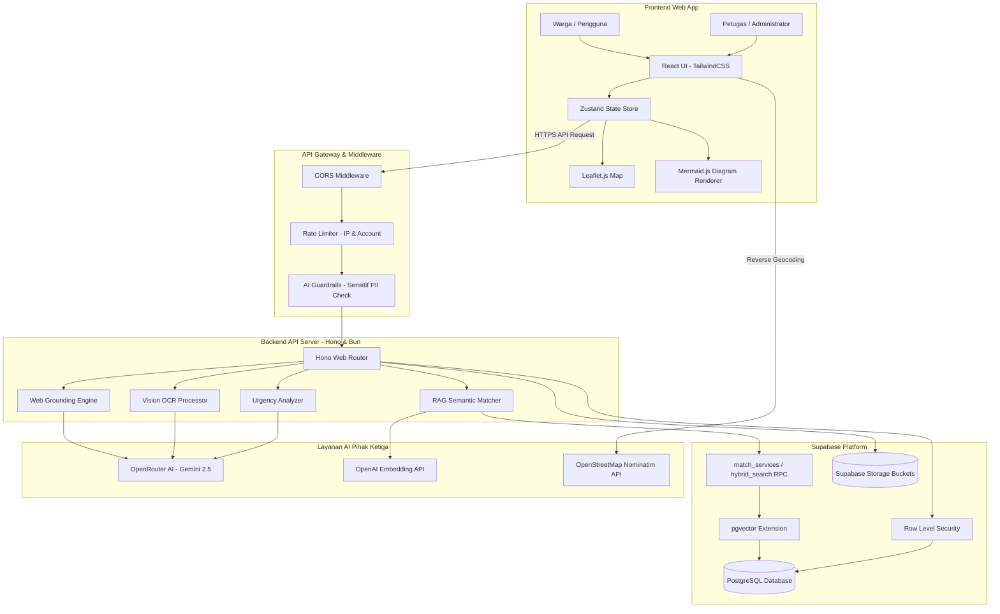

# 🏛️ KOMUNITAS — Portal Pelayanan Publik & Validasi Informasi Berbasis AI

> **Sistem Informasi Monorepo: Integrasi Layanan Aspirasi Warga, Verifikasi Klaim Hoaks (Web Grounding), Ringkasan Dokumen Regulasi (Mermaid.js Flowchart), dan Asisten RAG Pelayanan Publik.**
>
> Proyek ini dikembangkan secara profesional untuk **LKS EKKA National Competition 2026**.

---

## 👥 Profil Tim Pengembang (Team Profile)

Aplikasi ini dirancang, dibangun, dan dioptimalkan secara kolaboratif oleh tim **Pencari Berkah**:

| Nama Anggota | Peran & Spesialisasi | Kontak / GitHub |
| :--- | :--- | :--- |
| **Fahri Angga Pratama** | Lead Architect / Backend Engineer / AI Engineer | [GitHub/RyukaAngga](https://github.com/RyukaAngga) |
| **Fikri Awaluddin Rahmat** | Frontend Developer / UI-UX Engineer / GIS Specialist | [GitHub/FikriAwaluddin](https://github.com) |
| **Alif Ikhwan** | DevOps Engineer / QA & Security Analyst / Database Administrator | [GitHub/AlifIkhwan](https://github.com) |

---

## 📂 Struktur Monorepo (Monorepo Directory Layout)

Sistem ini diorganisasikan dalam satu Monorepo terpadu guna menyederhanakan pelacakan dependensi dan sinkronisasi API:

* 📁 **[Root Monorepo Directory](file:///c:/ryuka/lks-ai-2026/KOMUNITAS/)** — Konfigurasi utama, dokumentasi global, lisensi, dan manajemen repository.
* 📁 **[Frontend App Client (React & Vite)](file:///c:/ryuka/lks-ai-2026/KOMUNITAS/frontend/)** — Antarmuka web warga, peta pengaduan interaktif, visualisasi diagram alir Mermaid.js, dan panel admin. (Baca selengkapnya di: [Frontend README](file:///c:/ryuka/lks-ai-2026/KOMUNITAS/frontend/README.md)).
* 📁 **[Backend API Server (Hono & Bun)](file:///c:/ryuka/lks-ai-2026/KOMUNITAS/backend/)** — Server API utama berbasis Hono, RAG Engine, Web Grounding search compiler, dan middleware proteksi sistem. (Baca selengkapnya di: [Backend README](file:///c:/ryuka/lks-ai-2026/KOMUNITAS/backend/README.md)).

---

## 📌 Rumusan Masalah (Problem Statement) & Latar Belakang

Pelayanan publik dan penyebaran informasi di era digital Indonesia saat ini masih menghadapi tiga kendala struktural yang besar:
1. **Inefisiensi Birokrasi & Akses Informasi**: Dokumen regulasi pemerintah, undang-undang, serta persyaratan administratif sering kali ditulis dalam dokumen hukum yang sangat tebal, kaku, dan sulit dipahami oleh masyarakat awam. Warga menghabiskan banyak waktu hanya untuk mencari tahu prosedur dasar.
2. **Ledakan Misinformasi & Hoaks**: Rumor dan hoaks menyebar dengan kecepatan tinggi di media sosial. Warga kesulitan memverifikasi kebenaran suatu klaim informasi secara objektif karena keterbatasan akses terhadap situs klarifikasi cek fakta resmi.
3. **Sumbatan Jalur Pengaduan Warga**: Sistem pelaporan masalah daerah (seperti infrastruktur rusak atau sengketa sosial) sering kali lambat ditindaklanjuti. Laporan yang masuk tidak dipetakan berdasarkan lokasi koordinat riil dan tidak diklasifikasikan berdasarkan tingkat urgensinya, sehingga petugas kesulitan melakukan prioritas penanganan.

---

## 💡 Solusi yang Ditawarkan (Comprehensive Solutions)

**KOMUNITAS** hadir sebagai jembatan cerdas berbasis kecerdasan buatan (AI) yang menghubungkan warga dengan birokrasi pemerintahan secara transparan, akurat, dan terpetakan:

* **Asisten AI Prosedur Birokrasi (RAG Pipeline)**: Warga dapat bertanya seputar administrasi publik dalam bahasa sehari-hari. AI mencari basis pengetahuan regulasi menggunakan pencarian vektor (*cosine similarity*) dan menyajikan jawaban yang akurat, legal, serta bebas halusinasi.
* **Fungsi Cek Hoaks Cerdas (Web Search Grounding)**: Mengintegrasikan AI dengan mesin pencari web multi-fase untuk menyisir puluhan portal klarifikasi berita hoaks terpercaya di Indonesia secara real-time, memberikan *Confidence Score*, dan menampilkan tautan sumber klaim.
* **Visualisasi Alur Dokumen (Interactive Flowchart)**: Pengguna dapat mengunggah dokumen legal atau birokrasi yang panjang. AI akan mengekstrak informasi penting dan langsung merendernya dalam bentuk diagram alir interaktif (`Mermaid.js`) agar warga dapat melihat urutan langkah birokrasi secara instan.
* **Sistem Laporan Warga Spasial & Analisis Urgensi**: Warga dapat mengunggah laporan kerusakan/keluhan dengan melampirkan koordinat GPS riil (Live Map Leaflet). Di sisi backend, AI secara otomatis menganalisis dan menetapkan **Skor Urgensi** (Kritis, Tinggi, Sedang, Rendah) pada aduan tersebut agar petugas dapat memprioritaskan masalah darurat terlebih dahulu.

---

## 🖥️ Arsitektur & Alur Data Global (System Architecture)

Sistem ini dirancang dengan prinsip pemisahan tanggung jawab (*Separation of Concerns*), performa tinggi, dan proteksi berlapis (*Defense in Depth*):



---

## 🚀 Panduan Instalasi & Menjalankan Proyek (Production Setup)

### 📋 Prasyarat Sistem
* **Bun Runtime (v1.1.0 atau lebih baru)** — Untuk backend dan penyiapan skrip.
* **Node.js (v18.0 atau lebih baru) & npm** — Untuk frontend React/Vite.
* **Git** — Untuk klon repositori.
* **Akun Supabase** — Layanan database PostgreSQL terkelola.
* **Akun OpenRouter** — Untuk akses model AI.

---

### Langkah 1: Klon Repositori & Persiapan Direktori
```bash
git clone https://github.com/RyukaAngga/komunitasai.git
cd komunitasai
```

---

### Langkah 2: Setup Database di Supabase
1. Masuk ke dashboard proyek Supabase Anda.
2. Buka bagian **SQL Editor**.
3. Buat query baru, kemudian salin dan jalankan isi berkas SQL berikut secara berurutan:
   * **[database.sql](file:///c:/ryuka/lks-ai-2026/KOMUNITAS/backend/database.sql)**: Mengonfigurasi tabel dasar, indeks, dan RLS untuk warga & petugas.
   * **[migration_hybrid_urgency.sql](file:///c:/ryuka/lks-ai-2026/KOMUNITAS/backend/migration_hybrid_urgency.sql)**: Fungsi RRF pencarian hibrida, ekstensi `pgvector`, dan penyesuaian kolom urgensi aduan.
   * **[migration_rag_documents.sql](file:///c:/ryuka/lks-ai-2026/KOMUNITAS/backend/migration_rag_documents.sql)**: Struktur penyimpanan metadata dokumen PDF RAG.

---

### Langkah 3: Setup & Jalankan Backend (API Server)
1. Masuk ke direktori backend:
   ```bash
   cd backend
   ```
2. Instal dependensi menggunakan Bun:
   ```bash
   bun install
   ```
3. Buat berkas konfigurasi lingkungan `.env` dari template:
   ```bash
   cp .env.example .env
   ```
4. Sesuaikan variabel lingkungan dalam berkas `.env` dengan kredensial Anda:
   ```env
   PORT=3000
   NODE_ENV=production
   SUPABASE_URL=https://proyek-anda.supabase.co
   SUPABASE_SERVICE_ROLE_KEY=kunci-service-role-supabase-anda
   OPENROUTER_API_KEY=kunci-openrouter-anda
   DEFAULT_MODEL=google/gemini-2.5-flash
   EMBEDDING_MODEL=openai/text-embedding-3-small
   ```
5. Jalankan seed data untuk basis pengetahuan awal pelayanan publik:
   ```bash
   bun run src/index.ts --seed
   ```
6. Jalankan server dalam mode produksi atau pengembangan:
   ```bash
   bun dev
   ```
   *Backend kini berjalan aktif di `http://localhost:3000`.*

---

### Langkah 4: Setup & Jalankan Frontend (Client Web)
1. Buka terminal baru dan masuk ke direktori frontend:
   ```bash
   cd ../frontend
   ```
2. Instal dependensi menggunakan npm:
   ```bash
   npm install
   ```
3. Buat berkas konfigurasi lingkungan `.env` di root folder frontend:
   ```env
   VITE_API_BASE_URL=http://localhost:3000
   VITE_SUPABASE_URL=https://proyek-anda.supabase.co
   VITE_SUPABASE_ANON_KEY=kunci-anon-supabase-anda
   ```
4. Jalankan aplikasi web lokal:
   ```bash
   npm run dev
   ```
   *Frontend kini dapat diakses melalui browser di `http://localhost:5173`.*

---

## 🧠 Analisis & FAQ Teknis Ujian Juri (Jury Technical Q&A)

Berikut adalah ringkasan pertanyaan kritis yang kemungkinan diajukan oleh Dewan Juri LKS EKKA 2026 beserta jawaban teknis arsitekturnya:

### Q1: Bagaimana Anda memastikan AI tidak "berhalusinasi" saat menjawab pertanyaan seputar prosedur birokrasi yang kompleks?
> **Jawaban**: Kami menerapkan arsitektur **Retrieval-Augmented Generation (RAG)**. Sebelum pesan dikirim ke model bahasa OpenRouter (Gemini), backend kami terlebih dahulu mengubah pertanyaan user menjadi representasi vektor numerik menggunakan model embedding OpenAI. Kami kemudian melakukan pencarian hibrida di database Supabase PostgreSQL menggunakan fungsi *RPC match_services* untuk mengambil potongan informasi regulasi terpercaya. Hasil pencarian ini diinjeksikan langsung sebagai konteks utama (*grounding context*) ke dalam sistem prompt. AI diinstruksikan secara ketat untuk menjawab **hanya berdasarkan konteks tersebut** dan wajib menolak memberikan jawaban di luar basis data yang disediakan.

### Q2: Mengapa Anda menggabungkan pencarian vektor (Vector Search) dengan pencarian kata kunci (Full-Text Search) menggunakan algoritma Reciprocal Rank Fusion (RRF)?
> **Jawaban**: Pencarian vektor sangat baik dalam memahami kesamaan semantik dan maksud di balik kalimat warga, tetapi sering kali gagal mencocokkan kata kunci spesifik seperti kode singkatan regulasi, nomor undang-undang, atau nama daerah yang unik. Sebaliknya, *Full-Text Search (FTS)* berbasis indeks teks sangat presisi pada pencocokan kata kunci eksak tetapi tidak memahami konteks makna. Dengan menggabungkan keduanya menggunakan **RRF**, kami mengambil peringkat teratas dari kedua metode pencarian, menormalisasinya, dan menyajikan potongan informasi birokrasi dengan tingkat relevansi tertinggi kepada AI.

### Q3: Bagaimana platform Anda menangani isu keamanan privasi data warga (AI Responsibility) ketika mengirimkan data laporan atau chat ke API pihak ketiga?
> **Jawaban**: Kami menerapkan filter **PII Redaction (Responsible AI)** langsung di tingkat backend gateway. Sebelum data pesan dikirimkan ke server OpenRouter, middleware penyaring kami memindai teks input warga untuk mendeteksi informasi sensitif pribadi seperti nomor NIK (16 digit), nomor handphone Indonesia (format +62/08), serta alamat email menggunakan pola regular expression (Regex) teroptimasi. Jika ditemukan, data tersebut disensor (misal: `[SENSOR-NIK]`, `[SENSOR-PHONE]`) sebelum diteruskan ke LLM, guna menjamin tidak adanya kebocoran data pribadi warga.

### Q4: Mengapa sistem lokal chatbot Anda tidak memblokir pertanyaan sensitif seperti "kekerasan seksual" atau "pemerkosaan" padahal itu mengandung kata sensitif?
> **Jawaban**: Kami menyadari bahwa platform KOMUNITAS sering kali diandalkan untuk kebutuhan perlindungan warga (seperti kontak KPAI dan Komnas HAM). Jika kami memblokir kata kunci tersebut secara kasar (*naïve substring blocking*), warga korban kejahatan yang ingin mencari prosedur pelaporan kekerasan justru akan tertolak oleh sistem. Oleh karena itu, penyaring lokal guardrails kami hanya menargetkan kata kotor/kasar (*toxic*), ajakan pornografi vulgar, tindakan makar/kudeta, dan penghinaan SARA, sementara kata kunci hukum dan aduan formal tetap diperbolehkan lolos ke model AI yang memiliki filter moderasi bawaan yang jauh lebih dinamis.

### Q5: Bagaimana mekanisme integrasi real-time pada pembaruan status laporan warga di dashboard admin?
> **Jawaban**: Kami menggunakan mekanisme **Server-Sent Events (SSE)** (serta opsi WebSocket di client Supabase). Saat petugas mengubah status pengaduan (misal dari "Diproses" menjadi "Selesai") di dashboard admin, perubahan tersebut memicu pembaruan baris di tabel `citizen_reports` Supabase. Client frontend warga yang terhubung ke kanal pemantauan status laporan secara aktif akan menerima event payload real-time, sehingga notifikasi pembaruan status langsung muncul di layar warga tanpa perlu memuat ulang halaman (*polling*).

---

## 📄 Lisensi (License)

Platform ini dilisensikan di bawah **MIT License**. Dengan lisensi ini, Anda berhak menyalin, memodifikasi, mendistribusikan, dan menggunakan kode untuk keperluan komersial maupun akademis secara gratis, selama atribusi nama pencipta (Tim Pencari Berkah) tetap dicantumkan.

---

*Dikembangkan dengan integritas tinggi oleh **Tim Pencari Berkah** untuk kemajuan tata kelola pelayanan publik Indonesia. 🇮🇩*
